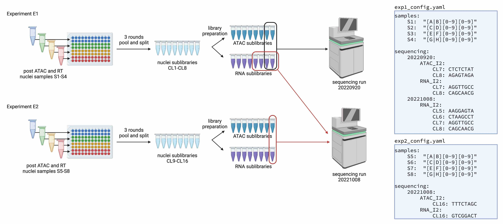

# shareseq-pipeline
Snakemake-based pipeline for processing SHARE-seq data 

## Features
- Parallelize via cloud or academic HPC cluster  
    (See [profile/config.yaml](profile/config.yaml) for an example to submit via Stanford's Sherlock cluster)
    - Processes a Novaseq run in under 4 hours in our tests on Sherlock
- Resume cleanly after interruptions
- Demultiplex individual samples barcoded using first round cell barcode
- Merge sequencing data from multiple sequencing runs of the same experiment
- Can be run in a pre-built [container](https://hub.docker.com/r/bettybliu/shareseq)
    - [Dockerfile](scripts/Dockerfile) provided for users to build custom containers if needed 

## Getting started
### Inputs
- Raw sequencing data as one or more bcl sequencing directories
    - In the future, fastq inputs will be supported
- Genome annotations:
    - bowtie2 and STAR genome indexes
    - gtf gene annotation
    - (optional) We provide a script to automatically download, filter and build genome indices (currently hg38 support only)
      ```bash
      cd scripts/references
      bash prep_genome.sh hg38
      ```
- A config yaml file ([example](runs/share_novaseq_b1.yaml))

### Outputs
- ATAC fragment file (10x compatible)
    - `ATAC/samples/{sample}.fragments.tsv.gz`
- RNA mtx file (10x compatible)
    - `RNA/samples/{sample}.matrix.mtx.gz`
    - `RNA/samples/{sample}.barcodes.tsv.gz`
    - `RNA/samples/{sample}.features.tsv.gz`
- Secondary outputs:
    - Stats on alignment rates
        - `ATAC/samples/alignment_stats.json`
        - `RNA/samples/alignment_stats.json`
    - Stats on barcode matching rates
        - `ATAC/samples/barcode_stats.json`
        - `RNA/samples/barcode_stats.json`
    - Per-sublibrary fragment and matrix files:
        - `ATAC/sublibraries/{sublibrary}/fragments.tsv.gz`
        - `RNA/sublibraries/{sublibrary}/matrix.mtx.gz`

## Running on Sherlock

0. Install required dependencies (see below)
1. Adapt the [example](runs/share_novaseq_b1.yaml) config to your input + output data locations
2. At the top level your config, set:
    ```yaml
    chunk_size: 2_000_000
    test_chunks: 2
    ```
3. From within the `shareseq-pipeline` directory, run:
   ```bash
   sbatch -p wjg,sfgf,biochem run.sh runs/MY_CONFIG_FILE.yaml
   ```
   Set the `-p` argument to your partition names, and set the path to your config file
   appropriately.
4. After that runs successfully, delete the test outputs and do a full-scale run by 
   setting a larger chunk size and removing `test_chunks` from the config.
   ```yaml
   chunk_size: 20_000_000
   ```
5. After the run has completed, generate summary plots by running the following 
   from within the `shareseq-pipeline` directory:
   ```bash
   sbatch -p wjg,sfgf,biochem --mem-per-cpu=64g plot.sh runs/MY_CONFIG_FILE.yaml
   ``` 

## Running on Sherlock with container

0. Install `singularity` and `snakemake` 
1. Build the container image file by running:
   ```
   singularity pull /YOUR/CONTAINERS/DIR/shareseq_latest.sif docker://bettybliu/shareseq:latest
   ```
2. Adapt the [example](runs/share_novaseq_b1.yaml) config to your input + output data locations,
   uncomment the singularity line and modify it to `singularity: "/YOUR/CONTAINERS/DIR/shareseq_latest.sif"`
3. At the top level your config, set:
    ```yaml
    chunk_size: 2_000_000
    test_chunks: 2
    ```
4. From within the `shareseq-pipeline` directory, run:
   ```bash
   sbatch -p wjg,sfgf,biochem run.sh runs/MY_CONFIG_FILE.yaml
   ```
   Set the `-p` argument to your partition names, and set the path to your config file
   appropriately.
5. After that runs successfully, delete the test outputs and do a full-scale run by
   setting a larger chunk size and removing `test_chunks` from the config.
   ```yaml
   chunk_size: 20_000_000
   ```
6. After the run has completed, generate summary plots by running the following
   from within the `shareseq-pipeline` directory:
   ```bash
   sbatch -p wjg,sfgf,biochem --mem-per-cpu=64g --job-name=plot --wrap "singularity exec --cleanenv /YOUR/CONTAINERS/DIR/shareseq_latest.sif plot.sh runs/MY_CONFIG_FILE.yaml"
   ```

---

## Theory of operation

The pipeline runs in two steps:
- `prep_fastq.smk` counts the number of reads, and runs bcl2fastq as needed
- `shareseq.smk` runs the actual analysis

Model of experiment:
- ***experiments*** consist of a run where a group of cells were physically present together and barcoded in the same set of plates.
    - `shareseq.smk` should be run once per split-and-pool ***experiment***
- ***samples*** are distinct biosamples or biological/technical replicates
    - ***samples*** are distinguished by being placed in distinct sets of wells during the first round of split+pool barcoding. 
    - Each ***experiment*** may have one or more ***samples***
- ***sublibraries*** are subsets of cells split after the final round of split+pool but prior to reversing crosslinking. 
    - If the same cell barcode is found in multiple sublibraries, the reads are assumed to have arisen from distinct cells. 
    - Each ***experiment*** may have one or more ***sublibraries***
    - Each ***sublibrary*** contains cells uniformly distributed from all the ***samples***. 
    - ***sublibraries*** can be pooled for sequencing, but each can be demultiplexed based on unique sequencing adapters (one adapter for ATAC and one adapter for RNA)
- ***sequencing runs*** can contain the ATAC and/or RNA reads for one or more ***sublibraries*** 
    - `prep_fastq.smk` should be run once per ***sequencing run*** 

In simple cases, you will have one experiment and one sequencing run. In this case a single config file is sufficient for both `prep_fastq.smk` and `shareseq.smk`.

In complex cases where experiments are pooled onto different sets of sequencing runs, you may need to make one config file per sequencing run for `prep_fastq.smk` and one config file per experiment for `shareseq.smk`. The figure below illustrates an example where separate config files are created for `shareseq.smk`.



---

## Required dependencies
- bcl2fastq
- bgzip
- bowtie2 version >=2.4.2 (flag --sam-append-comment)
- fastp
- featureCounts (subread)
- pysam
- python3
- STAR
- samtools
- snakemake
- tabix
- umi_tools
- zstd

Builtin unix tools:
- awk
- gcc
- grep
- gzip
- sort
- split

### Additional dependencies needed for plotting
- poppler
- R
    - Seurat
    - ggplot2
    - patchwork
    - ggrastr
    - gridExtra
    - dplyr
    - rjson
    - [BPCells](https://bnprks.github.io/BPCells/index.html)

